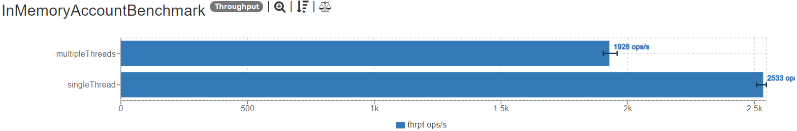
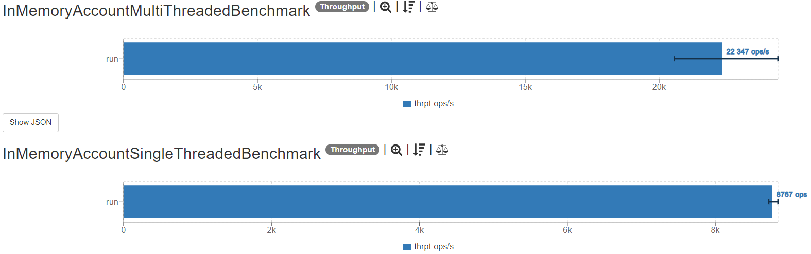

# Banking kata ([source](https://kata-log.rocks/banking-kata))
## Description
Write a class Account that offers the following methods:
- `void deposit(int)` 
- `void withdraw(int)`
- `String printStatement()`

An example statement would be:

    Date        Amount  Balance
    24.12.2015    +500      500
    23.8.2016     -100      400

## Performance improvements
The application performance was verified using a JMH benchmark. After that a small refactoring was performed
and the performance improvement is obvious as shown on the images below (more = better).

Before:

After:
