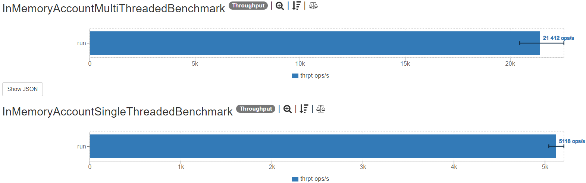
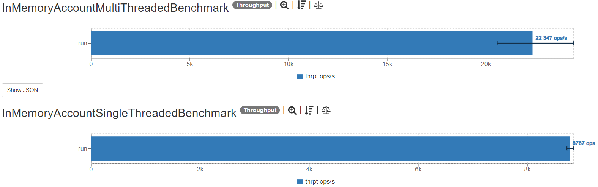
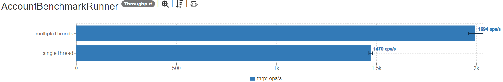
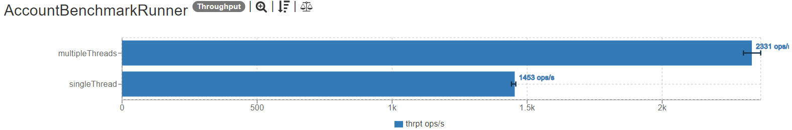
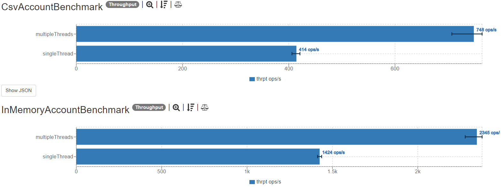

# [Banking kata](https://kata-log.rocks/banking-kata)
## Description
Write a class Account that offers the following methods:
- `void deposit(int)` 
- `void withdraw(int)`
- `String printStatement()`

An example statement would be:

    Date        Amount  Balance
    24.12.2015    +500      500
    23.8.2016     -100      400

## Performance improvements
The application performance was verified using a JMH benchmark. After that a small refactoring was performed
and the performance improvement is obvious as shown on the images below (more = better).
_Generated using [this page](https://jmh.morethan.io/)_.

Before:

After:


---

After improvement of the benchmark, different approach to synchronization while printing was verified once again
and a 20% performance improvement can be easily observed:

Before:

After:


## Additional requirements

### CSV file based account implementation ✅
#### Performance comparison


### Statement returned as an HTML table 🔜

Example:

<table>
    <thead>
        <tr>
            <th>Date</th>
            <th>Amount</th>
            <th>Balance</th>
        </tr>
    </thead>
    <tbody>
        <tr>
            <td>24.12.2015</td>
            <td>+500</td>
            <td>500</td>
        </tr>
        <tr>
            <td>23.8.2016</td>
            <td>-100</td>
            <td>400</td>
        </tr>
    </tbody>
</table>

```html
<table>
    <thead>
        <tr>
            <th>Date</th>
            <th>Amount</th>
            <th>Balance</th>
        </tr>
    </thead>
    <tbody>
        <tr>
            <td>24.12.2015</td>
            <td>+500</td>
            <td>500</td>
        </tr>
        <tr>
            <td>23.8.2016</td>
            <td>-100</td>
            <td>400</td>
        </tr>
    </tbody>
</table>
```