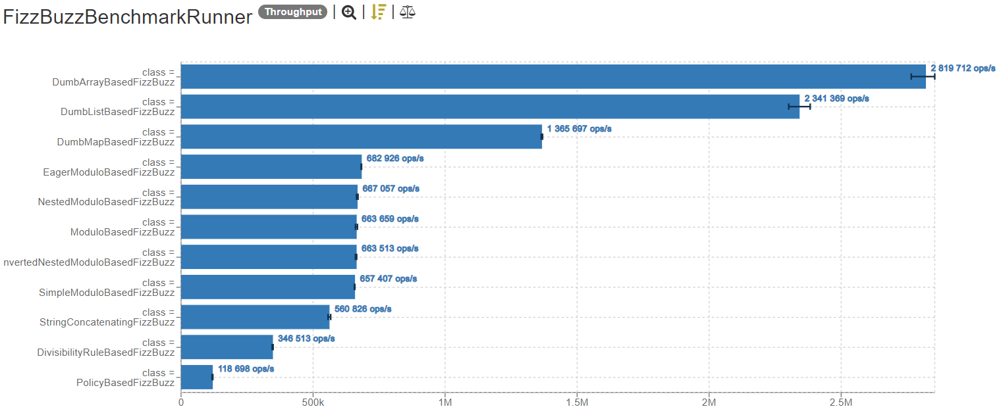

# [Fizz Buzz kata](https://kata-log.rocks/fizz-buzz-kata)
## Requirements
- Write a program that prints one line for each number from 1 to 100
- For multiples of three print Fizz instead of the number
- For the multiples of five print Buzz instead of the number
- For numbers which are multiples of both three and five print FizzBuzz instead of the number

## Performance
_Generated using [this page](https://jmh.morethan.io/)_.
