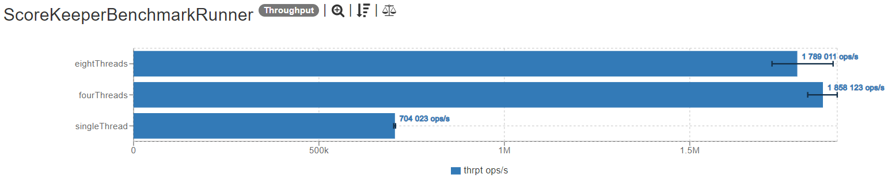

# [Score Keeper kata](https://kata-log.rocks/score-keeper-kata)
## Problem 
We need software to deliver the proper data to the scoreboard for a basketball team. 
Unfortunately the people using our software are not the brightest lights under the sun, 
so they need six buttons (each team can score either 1, 2 or 3 points with a single shot).

## Requirements
Write a class `ScoreKeeper` which offers following methods:

    void scoreTeamA1()

    void scoreTeamA2()

    void scoreTeamA3()

    void scoreTeamB1()

    void scoreTeamB2()

    void scoreTeamB3()

    String getScore()

## Rules
The returned String always has seven characters. An example would be: `000:000`.

## Performance
_Generated using [this page](https://jmh.morethan.io/)_.
