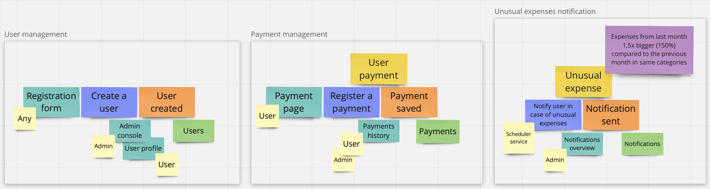
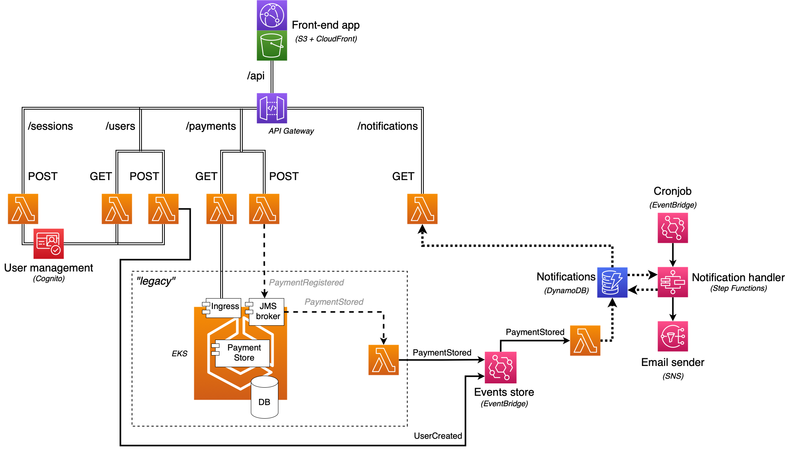
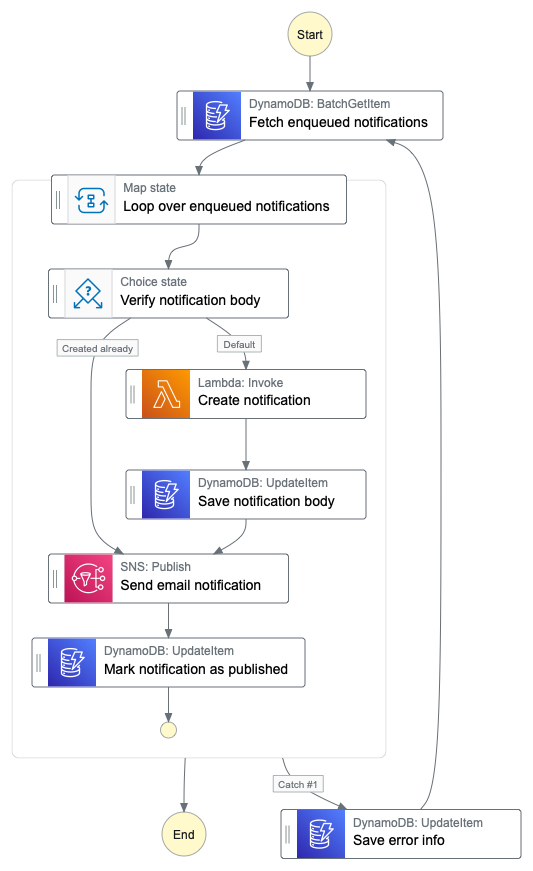
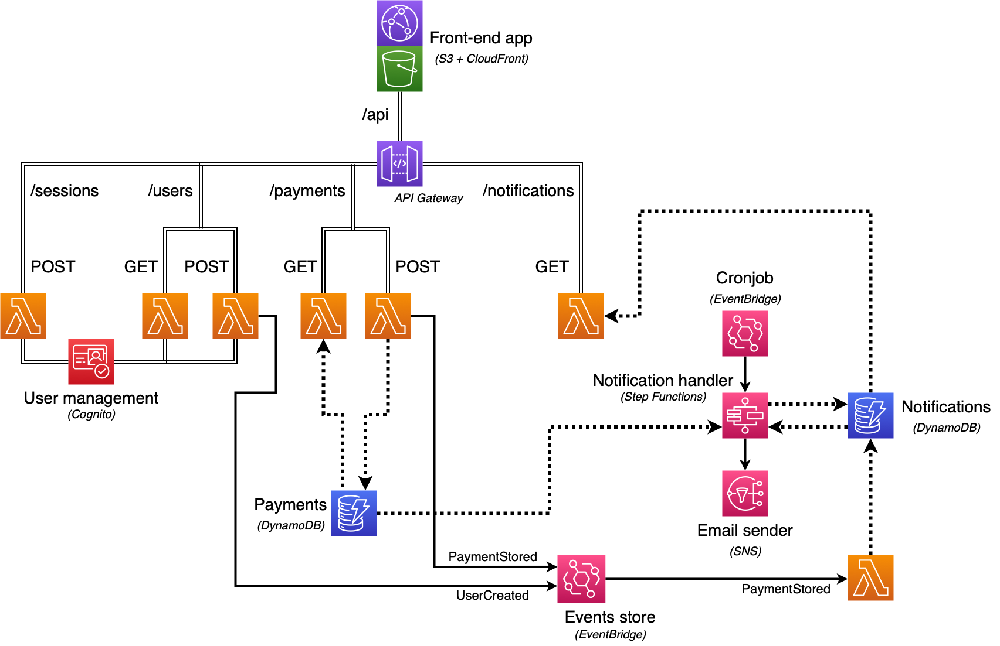

# [Unusual Spending kata](https://kata-log.rocks/unusual-spending-kata)
<!-- TOC -->
* [Unusual Spending kata](#unusual-spending-kata)
  * [Requirements](#requirements)
  * [Follow-up (over-the-top)](#follow-up--over-the-top-)
    * [Architecture](#architecture)
      * [Diagrams](#diagrams)
    * [Events](#events)
      * [UserCreated](#usercreated)
      * [PaymentStored](#paymentstored)
      * [_"Legacy events"_](#_legacy-events_)
        * [PaymentRegistered](#paymentregistered)
        * [PaymentStored](#paymentstored)
    * [Notifications table](#notifications-table)
    * [Kubernetes microservices](#kubernetes-microservices)
      * [Rationale](#rationale)
      * [Setup and usage](#setup-and-usage)
        * [Recommended reading](#recommended-reading)
      * [Pods SSH commands](#pods-ssh-commands)
        * [jms-broker](#jms-broker)
  * [TODO list](#todo-list)
<!-- TOC -->
## Requirements
You work at a credit card company and as a value-add they want to start providing alerts to users when their spending in any particular category is higher than usual.

A Payment is a simple value object with a expense, description, and category.

A Category is an enumerable type of a collection of things like 
“entertainment”, “restaurants”, and “golf”.

For a given userId, fetch the payments for the current month and the previous month.
Compare the total amount paid for each month, grouped by category. 
Filter down to the categories for which the user spent at least 50% more 
this month than last month.

Compose an e-mail message to the user that lists the categories 
for which spending was unusually high, with a subject like 
“Unusual spending of $1076 detected!” and this body:

    Hello card user!

    We have detected unusually high spending on your card in these categories:

    * You spent $148 on groceries
    * You spent $928 on travel

    Love,
    The Credit Card Company

## Follow-up (over-the-top)
### Architecture
The follow-up to the basic kata requirements was initially planned 
as a small system consisting of a few microservices working together 
in a Kubernetes cluster. 

To come up with the target state of the application a simple, 
one-man event storming was performed. First and foremost it was a way of 
getting to know the technique in practice, 
but it also enabled discovering natural domain boundaries.


Later on as I've caught up more and more and learned about serverless design
and Amazon Web Services, I've decided to leave the part of the system
that was already running on Kubernetes 
(Payment Store service, Artemis JMS broker, H2 database) 
in place ("legacy") and instead of transforming other parts 
to microservices in the same K8S cluster
I redesigned the solution to tackle a serverless approach.

#### Diagrams
Target system architecture (with "legacy"):


Notification handler (Step Functions):


Notification handling could also be implemented as separated lambdas based on
notification-related events, e.g.
`NotificationCreated`, `NotificationSent`, `NotificationModificationFailed`.
Such architecture would however be still strictly coupled - 
step functions seem more explicit in this case.

Final system architecture:


### Events
`NotificationSent` event could also be added, but it's omitted for now
as it doesn't seem to be necessary.
#### UserCreated
```json
{
  "username": "test_user",
  "timestamp": "2022-07-01T10:12:37+02"
}
```
#### PaymentStored
```json
{
  "payerUsername": "test_user",
  "timestamp": "2022-07-02T12:13:49+02"
}
```
#### _"Legacy events"_
Events sent to the "legacy" JMS broker in the Kubernetes cluster.
Normally it would be migrated to match other events, but was left in place to resemble
a not-fully migrated system.
##### PaymentRegistered
The service polls payment events from a topic (`payment/register/<version>`)
and saves them in the database for future use.
Example of such an event:
```json
{
  "payerUsername": "test_user",
  "details": {
    "id": "7b8d8c9f-a8fb-486d-9c44-96008b30118e",
    "timestamp": "2022-07-02T12:13:49+02",
    "category": "groceries",
    "description": "Credit card payment at Walmart",
    "cost": {
      "amount": 12.99,
      "currency": "USD"
    }
  }
}
```
##### PaymentStored
```json
{
  "payerUsername": "test_user",
  "timestamp": "2022-07-02T12:13:49+02",
  "cost": "$12.99"
}
```

### Notifications table
Notifications will be stored in a DynamoDB table.

 | username | period | base_period | body | sent_to | last_error | retry_count |
|----------|--------|-------------|------|---------|------------|-------------|
| S        | S      | S           | S    | S       | S          | N           |

- username    (_String_) - username matching the AWS Cognito entry
- period      (_String_) - dates between which the verified payments are aggregated;
format: `yyyy-MM-dd - yyyy-MM-dd`
- base_period (_String_) - dates between which the base payments are aggregated;
format: `yyyy-MM-dd - yyyy-MM-dd`
- body        (_String_) - notification body that should be sent
- sent_to     (_String_) - target to which the notification was sent; 
according to the initial requirements it's an email address, 
but could also be for example a phone number;
empty means notification hasn't been sent yet
- last_error  (_String_) - information about last error that occurred 
during notification handling (creation, publication)
- retry_count (_int_)    - indicates how many times the notification handling was retried
after an error; should be used to prevent retrying infinitely 

### Kubernetes microservices
#### Rationale
At first all the initial code was to be divided into microservices
and run in a Kubernetes cluster, but the approach was changed to more serverless-focused.
The Kubernetes cluster was left as initially prepared (except for the front-end app
that should be extracted and served from an S3 host with possible CloudFront support).

The whole setup was prepared so that it was easy to run the whole application
locally, but also the main thought behind the configuration was simplicity.
An H2 database configured as a part of the cluster was used as a shortcut,
which some consider to be a bad practice and in a cloud-based architecture
it **should** be replaced with a database stored separately.
In AWS it would be: migration to DynamoDB - preferred as there are no actual relations 
in the database / Aurora / RDS / EC2. It was left in place as part of 
the Kubernetes solution - might be considered as a "legacy" part of the system.
Artemis JMS broker was configured inline in the Kubernetes deployment configuration,
which was also a way to spend less time on the configuration part.
Again - in the cloud environment it should be replaced with a solution designed
to handle messaging. In AWS it would be: SNS / EventBridge / Kinesis / Amazon MQ.
Since topics are used, SQS would not be suitable.

#### Setup and usage
All the steps to run the cluster are included in the `scripts/runLocalCluster.sh` file.
JDK 17, Maven, Docker, Kubernetes, Minikube and Node.js need to be installed.

1. Startup Minikube:


    minikube start

2. Build the project using:


    mvn clean package -Dquarkus.container-image.build=true

(includes creation of a Jib images)

3. To load the images into the local Minikube instance use:


    minikube image load io.github.jonarzz/payment-storage-service:1.0.0-SNAPSHOT

(image will not be reloaded if a pod in a deployment using the image is running - see: `kubectl scale` command below)

3. (Re)load Kubernetes configuration:


    kubectl apply -k k8s

(it's best to start up the cluster with 0 replicas of the services deployment
and increase the number later, when database and JMS broker pods are up)

4. Enable `ingress` addon and open a tunnel in Minikube:


    minikube addons enable ingress
    minikube tunnel

GraphQL console is available at: http://localhost/api/payment/q/graphql-ui

---

Additional useful command examples:
- `kubectl get svc` (also `deploy`, `pod` etc.) - get state of running services (deployments, pods)
- `kubectl scale --replicas=0 deployment/payment-storage-service` - stop all running pods in given deployment
- `kubectl scale --replicas=1 deployment/payment-storage-service` - start pods in given deployment (with no replication) 
- `kubectl exec -it deploy/payment-storage-service -- /bin/bash` - start executing commands inside given deployment;
the command after `--` could be anything, e.g. it could be a `curl` command verifying if other deployment's service 
is accessible from given deployment - in case of a single command the session quits after executing the command
- `kubectl port-forward service/payment-storage-service 8080:80` - run a tunnel forwarding the localhost port `8080` to the `80` port 
for given service 
- `kubectl explain <thing>` (e.g. `kubectl explain deployments.spec.replicas`) - display documentation of the given "thing"
- `kubectl logs <pod_name> -c <init_container_name> -f` - display logs of init container for given pod (following new lines)
- `minikube image ls --format table` - list Minikube images - by verifying image ID it's possible to check if the image was successfully reloaded 
- `minikube image rm io.github.jonarzz/payment-storage-service:1.0.0-SNAPSHOT` - remove the image from Minikube images
- `minikube dashboard` - run a web-accessible dashboard showing the state of the cluster

See [kubectl](https://kubernetes.io/docs/reference/generated/kubectl/kubectl-commands) 
and [minikube](https://minikube.sigs.k8s.io/docs/commands/) commands pages for more.

##### Recommended reading
- https://learnk8s.io/spring-boot-kubernetes-guide
- https://learnk8s.io/blog/kubectl-productivity

#### Pods SSH commands
##### jms-broker

Send a message:
```shell
broker/bin/artemis producer \
--destination topic://payment/register/v1 \
--user artemis \
--password artemis \
--message-count 1 \
--message '{
"payerUsername": "test_user",
"details": {
  "id": "2aad8c9f-a8fb-486d-9c44-96008b30117b",
  "category": "groceries",
  "description": "Credit card payment at Walmart",
  "cost": {
    "amount": 37.99,
    "currency": "USD"
}}}'
```

```shell
broker/bin/artemis producer \
--destination topic://payment/register/v1 \
--user artemis \
--password artemis \
--message-count 1 \
--message '{
"payerUsername": "test_user",
"details": {
  "id": "ba1d8c9f-c7fb-486d-9c44-98008b30117c",
  "timestamp": "2022-07-27T16:13:21+02",
  "category": "travel",
  "cost": {
    "amount": 987.75,
    "currency": {
      "alphaCode": "PLN",
      "languageTag": "pl-PL"
    }
}}}'
```

Check queue state:
```shell
broker/bin/artemis queue stat \
--user artemis \
--password artemis \
--queueName payment/register/v1
```

## TODO list
- :white_check_mark: change `payerId` to `payerUsername` in the payment-storage-service module
- :white_check_mark: rename module payment-service to payment-storage-service
- :white_check_mark: remove time from aggregation timespan (should be a date-only period)
- :white_check_mark: emit PaymentStored event from payment-storage-service
- :white_check_mark: transform the code to comply with hexagonal architecture better
- :white_check_mark: merge strictly related modules together: expense-service and notification-service
- :white_check_mark: integration test of front-end app using payment-storage-service API 
- :memo: introduce CloudFoundation configuration
- :memo: add EKS configuration to include existing "legacy" Kubernetes config
- :memo: add API gateway configuration
- :memo: extract front-end app to S3
- :memo: add lambda for payment registration
- :memo: add lambda reading stored payments
- :memo: create EventBridge event store configuration
- :memo: add lambda rewriting and transforming legacy PaymentStored events to EventBridge event store
- :memo: configure Notifications table in DynamoDB
- :memo: add lambda triggered by PaymentStored event that should create a Notifications
  table item if an entry for given period (configurable) does not exist
- :memo: add lambda exposing access to the Notifications table through API
- :memo: create Step Functions handling notifications body creation
- :memo: add notification publishing to the Step Functions
- :memo: add EventBridge cron job to trigger the Step Functions
- :memo: allow dynamic selection of notification period type (month, week etc.)
- :memo: add Cognito configuration
- :memo: expose API for users sign in, login and information retrieval
- :memo: create notifications using locale defined for the user in Cognito attributes
- :memo: secure API calls using Cognito roles (user / admin)
- :memo: add front-end components to present what API exposes
- :memo: configure CloudFront for the front-end app
- :memo: add X-Ray and CloudWatch configuration
- :memo: transform "legacy" Kubernetes cluster to the final architecture