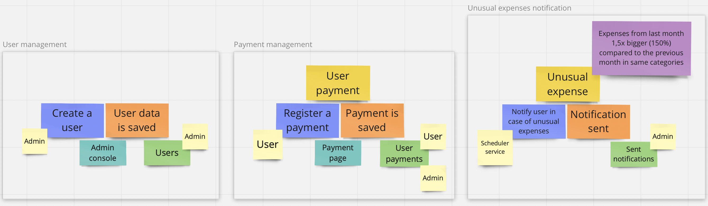

# [Unusual Spending kata](https://kata-log.rocks/unusual-spending-kata)
## Requirements
You work at a credit card company and as a value-add they want to start providing alerts to users when their spending in any particular category is higher than usual.

A Payment is a simple value object with a expense, description, and category.

A Category is an enumerable type of a collection of things like 
“entertainment”, “restaurants”, and “golf”.

For a given userId, fetch the payments for the current month and the previous month.
Compare the total amount paid for each month, grouped by category. 
Filter down to the categories for which the user spent at least 50% more 
this month than last month.

Compose an e-mail message to the user that lists the categories 
for which spending was unusually high, with a subject like 
“Unusual spending of $1076 detected!” and this body:

    Hello card user!

    We have detected unusually high spending on your card in these categories:

    * You spent $148 on groceries
    * You spent $928 on travel

    Love,
    The Credit Card Company

### Follow-up
The follow-up to the basic kata requirements is a small system made of a few microservices 
working together in a Kubernetes cluster. To organize the target state of the application
a simple, one-man event storming was performed as a way of getting to know the technique in practice.


## Microservices
### Payment
#### Events
##### PaymentRegisteredEvent
The service polls payment events from a topic (`payment/register/<version>`) and saves them in the database for future use.
Example of such an event:
```json
{
  "id": "7b8d8c9f-a8fb-486d-9c44-96008b30118e",
  "timestamp": "2022-07-02T12:13:49+02",
  "payerId": 1,
  "details": {
    "category": "groceries",
    "description": "Credit card payment at Walmart",
    "cost": {
      "amount": 12.99,
      "currency": "USD"
    }
  }
}
```

##### UserCreatedEvent
TBD (move to a different MS)

## Kubernetes cluster
All the microservices were organized into a Kubernetes cluster.
The whole setup was prepared so that it was easy to run the whole application
locally, but also the main thought behind the configuration was simplicity.
An H2 database configured as a part of the cluster was used as a shortcut,
which some consider to be a bad practice (using default credentials **is** a bad practice).
Artemis JMS broker was configured inline in the Kubernetes deployment configuration,
which was also a way to spend less time on the configuration part.

1. Startup Minikube:


    minikube start

2. Build the project using:


    mvn clean package -Dquarkus.container-image.build=true

(includes creation of a Jib images)

3. To load the images into the local Minikube instance use:


    minikube image load io.github.jonarzz/payment-service:1.0.0-SNAPSHOT

(image will not be reloaded if a pod in a deployment using the image is running - see: `kubectl scale` command below)

3. (Re)load Kubernetes configuration:


    kubectl apply -k k8s

(it's best to start up the cluster with 0 replicas of the services deployment
and increase the number later, when database and JMS broker pods are up)

4. Enable `ingress` addon and open a tunnel in Minikube:


    minikube addons enable ingress
    minikube tunnel

GraphQL console is available at: http://localhost/payment/q/graphql-ui

---

Additional useful command examples:
- `kubectl get svc` (also `deploy`, `pod` etc.) - get state of running services (deployments, pods)
- `kubectl scale --replicas=0 deployment/payment-service` - stop all running pods in given deployment
- `kubectl scale --replicas=1 deployment/payment-service` - start pods in given deployment (with no replication) 
- `kubectl exec -it deploy/payment-service -- /bin/bash` - start executing commands inside given deployment;
the command after `--` could be anything, e.g. it could be a `curl` command verifying if other deployment's service 
is accessible from given deployment - in case of a single command the session quits after executing the command
- `kubectl port-forward service/payment-service 8080:80` - run a tunnel forwarding the localhost port `8080` to the `80` port 
for given service 
- `kubectl explain <thing>` (e.g. `kubectl explain deployments.spec.replicas`) - display documentation of the given "thing"
- `kubectl logs <pod_name> -c <init_container_name> -f` - display logs of init container for given pod (following new lines)
- `minikube image ls --format table` - list Minikube images - by verifying image ID it's possible to check if the image was successfully reloaded 
- `minikube image rm io.github.jonarzz/payment-service:1.0.0-SNAPSHOT` - remove the image from Minikube images
- `minikube dashboard` - run a web-accessible dashboard showing the state of the cluster

See [kubectl](https://kubernetes.io/docs/reference/generated/kubectl/kubectl-commands) 
and [minikube](https://minikube.sigs.k8s.io/docs/commands/) commands pages for more.

### Recommended reading
- https://learnk8s.io/spring-boot-kubernetes-guide
- https://learnk8s.io/blog/kubectl-productivity

### Pods SSH commands
#### jms-broker

Send a message:
```shell
broker/bin/artemis producer \
--destination topic://payment/register/v1 \
--user artemis \
--password artemis \
--message-count 1 \
--message '{
"id": "2aad8c9f-a8fb-486d-9c44-96008b30117b",
"payerId": 1,
"details": {
  "category": "groceries",
  "description": "Credit card payment at Walmart",
  "cost": {
    "amount": 37.99,
    "currency": "USD"
}}}'
```

```shell
broker/bin/artemis producer \
--destination topic://payment/register/v1 \
--user artemis \
--password artemis \
--message-count 1 \
--message '{
"id": "ba1d8c9f-c7fb-486d-9c44-98008b30117c",
"payerId": 1,
"details": {
  "timestamp": "2022-07-27T16:13:21+02",
  "category": "travel",
  "cost": {
    "amount": 987.75,
    "currency": {
      "alphaCode": "PLN",
      "languageTag": "pl-PL"
    }
}}}'
```

Check queue state:
`broker/bin/artemis queue stat --user artemis --password artemis --queueName payment/register/v1`